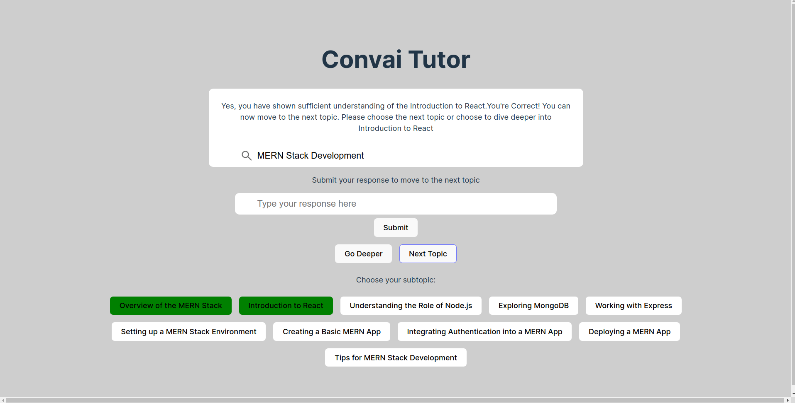

# GPT Tutor : Your Personal AI Tutor Powered by GPT-3.5
GPT Tutor is a web-based application built with React.js, Node, Express, and OpenAI APIs that allows users to learn any skill or topic step by step. The Tutor evaluates your responses at each step and only proceeds to the next step if it detects that you have a clear understanding of the topic


## Installation 
To get started with GPT Tutor, follow the steps below:

- Clone the repository by running the following command in your terminal:
```
git clone git@github.com:adityachandra1/convai-gpt-tutor.git
```

- Navigate to the project directory by running:
```
cd convai-gpt-tutor
```
 - Open the `/server` directory 
 - Add your OpenAI API Key to `example.env` file
 - Rename the `example.env` file to `.env`

### For Linux Users
You can directly excute the start script to run the project. 
```
bash start.sh
```

### Others
  ### Server
 - Run the server
 ```
 cd /server
npm install
npm start
```
### Client
- Start the client by running:
```
cd /client
npm install 
npm run dev
```
- Open localhost `http://localhost:5173/`
  
This will start the client and you can now start using GPT Tutor to learn any skill or topic that you desire.

## Features
The platform is designed to help you quickly and easily learn about any subject that interests you. Here's how it works:

- Start by typing the subject you'd like to learn about in the search bar. When you hit enter, the **GetTopics** function will be called, and a list of topics related to your search query will be fetched from the server using GPT 3.5.

- Once the list of topics is generated, each topic will be displayed as a dynamically rendered button. Simply click on the button for the topic you want to learn more about.

- Clicking on a topic button will call the **explainTopic** function, which uses GPT3.5 to provide you with a detailed explanation of the topic and also ask question related to it at the end. You'll be asked to type your response to the question in the newly generated response field.

- Your response will then be evaluated by the **evaluateResponses** function which uses the tutor to check if it is accurate and sufficient to move on to the next topic. If your response is correct, you'll move on to the next topic. If not, you can try again.

- To gain even more in-depth knowledge about the subject, you can click on the **Go Deeper** button, which branches down even further to show you a list of subtopics related to the topic you are currently learning.

- Once you've successfully answered the question and want to move on to the next topic, simply click on the **Next Topic** button.

- If you want to retry the same question, you can click on the **Retry** button.


## APIs

```
Route: /api/prompt/topics
Method: POST
```
**Description:** This API returns a list of subtopics and a brief introduction about a subject provided in the request body.


```
Route: /api/prompt/explain
Method: POST
```
**Description:** This API returns a brief description of a topic and a simple question related to the topic, with respect to the subject provided in the request body.


```
Route: /api/prompt/evaluate
Method: POST
```
**Description**: This API evaluates whether a student's response to a tutor's question on a topic shows sufficient understanding or not. The topic, student response, and tutor's question are provided in the request body.

### Screenshot


### Scope of Improvement
- Improvement in UI
- Adding User Authentication and saving user progress to the DB. So that users can continue from where they left off and their progress isn't deleted on refreshing the page.

